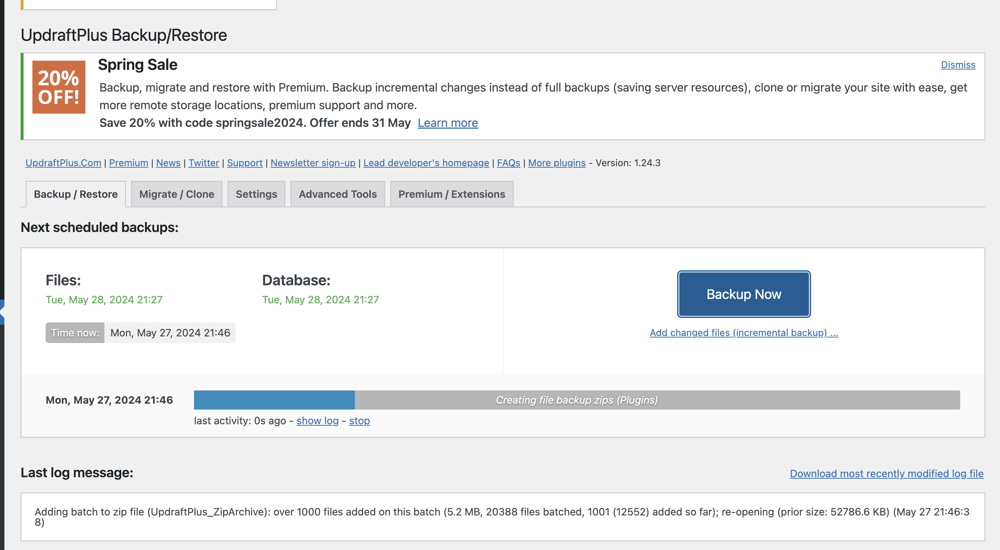

# jerrywestonmize.com

## Colibri Theme Update Documentation

When you update the theme, theme file edits are cleared away. These modifications need to be added back after updating the colibri theme.

### `header.php`

```

<!DOCTYPE html>
<html <?php language_attributes(); ?>>
<head>
    <meta charset="<?php bloginfo( 'charset' ); ?>">
    <meta name="viewport" content="width=device-width, initial-scale=1">
    <link rel="profile" href="http://gmpg.org/xfn/11">
	<?php acf_form_head();?> // THIS IS WHAT YOU NEED TO RE-ADD
    <?php wp_head(); ?>
    <?php colibriwp_theme()->get( 'css' )->render(); ?>
</head>

<body id="colibri" <?php body_class(); ?>>
<?php
if ( function_exists( 'wp_body_open' ) ) {
    wp_body_open();
} else {
    do_action( 'wp_body_open' );
}
?>


<div class="site" id="page-top">
    <?php colibriwp_theme()->get( 'header' )->render(); ?>

```

### `functions.php`

```

// begin mods
// change the logout url
add_filter('logout_url', 'jwm_logout_url');
function jwm_logout_url($default)
{
	// set your URL here
	// // Parse the URL into its components.
	$parsedUrl = parse_url($default);

	// Get the query string from the parsed URL.
	$queryString = $parsedUrl['query'];

	// Remove the leading question mark from the query string.
	return 'https://jerrywestonmize.com/jwmsecure.php?' . $queryString;
}

// change login url - added on 1/6/2024 becaus login form began redirecting
// to default wp-login.php?redirect_to ... after submission
add_filter('login_url', 'jwm_login_url');
function jwm_login_url($default) {
	$parsedUrl = parse_url($default);
	$queryString = $parsedUrl['query'];
	return 'https://jerrywestonmize.com/jwmsecure.php?' . $queryString;
}

// change the forgot password URL on login page
function jwm_lostpassword_url()
{
	return 'https://jerrywestonmize.com/jwmsecure.php?action=lostpassword';
}
add_filter('lostpassword_url', 'jwm_lostpassword_url');

// change the reset password link in the email you get after clicking forgot password
function custom_reset_password_message($message, $key, $user_login, $user_data)
{
	// Check if the message contains the URL we want to replace
	if (strpos($message, 'wp-login.php?action=rp') !== false) {
		$user_locale = get_user_meta($user_data->ID, 'locale', true);
		$wp_lang = !empty($user_locale) ? $user_locale : 'en_US';
		// Construct the new URL
		$new_url = 'https://jerrywestonmize.com/jwmsecure.php?action=rp&key=' . $key . '&login=' . rawurlencode($user_login) . '&wp_lang=' . $wp_lang;

		$old_url = 'https://jerrywestonmize.com/wp-login.php?action=rp&key=' . $key . '&login=' . rawurlencode($user_login) . '&wp_lang=' . $wp_lang;
		// Replace the old URL with the new URL
		$message = str_replace($old_url, $new_url, $message);
	}

	return $message;
}
add_filter('retrieve_password_message', 'custom_reset_password_message', 10, 4);

// change the behavior after log out completion (default redirects to wp-login.php)
add_action('wp_logout', 'jwm_logout_complete');

function jwm_logout_complete()
{
	wp_redirect(site_url());
	exit();
}

add_action('after_setup_theme', 'remove_admin_bar');
function remove_admin_bar()
{
	if (!current_user_can('administrator') && !is_admin()) {
		show_admin_bar(false);
	}
}

// end of mods

add_action('after_switch_theme', 'colibriwp_check_php_version');
......

```

## Payment Receipts - Amelia Code Modification

If the Amelia plugin is updated, there is a chance this code will need to be re-added.

Amelia doesn't properly trigger Stripe payment receipts because by default it does not tie in "receipt_email" key in the initial PaymentIntent creation API request to Stripe.

To fix this, I customized the logic of `wp-content/plugins/ameliabooking/src/Infrastructure/Services/Payment/StripeService.php` to add that `receipt_email` key with the value of the `Customer Email` metadata that Weston had already added under the Amelia > Settings > Payments > Stripe > Customer Metadata menu.

These are the specific changes to the [wp-content/plugins/ameliabooking/src/Infrastructure/Services/Payment/StripeService.php](wp-content/plugins/ameliabooking/src/Infrastructure/Services/Payment/StripeService.php) file:

```
...

if ($stripeSettings['manualCapture']) {
	$stripeData['capture_method'] = 'manual';
}

if ($data['metaData']) {
	$stripeData['metadata'] = $data['metaData'];
}

...

// begin mods with fallback values 
if ($data['description']) {
	$stripeData['description'] = $data['description'];
} else if (!empty($data['metaData']['Customer Name'])) {
	$stripeData['description'] = 'Payment for ' . $data['metaData']['Customer Name'] . ' - ' . $data['metaData']['Customer Email'] . ' - ' . $data['metaData']['Service'] . '';
}

$customerId = $this->createCustomer($data, $additionalStripeData);

if ($customerId) {
	$stripeData = array_merge($stripeData, ['customer' => $customerId]);
}

if (!empty($data['customerData']) && !empty($data['customerData']['email'])) {
	$stripeData['receipt_email'] = $data['customerData']['email'];
} else if (!empty($data['metaData']['Customer Email'])) {
	$stripeData['receipt_email'] = $data['metaData']['Customer Email'];
}
// end mods with fallback values 
....

$stripeData = apply_filters(
	'amelia_before_stripe_payment',
	$stripeData
);

$intent = PaymentIntent::create($stripeData);

```

According to these docs on the PaymentIntent API reference: [https://stripe.com/docs/api/payment_intents](https://stripe.com/docs/api/payment_intents), including a `receipt_email` will automatically trigger a receipt to be sent to that email upon the success of the payment intent. [https://stripe.com/docs/api/payment_intents/object#payment_intent_object-receipt_email](https://stripe.com/docs/api/payment_intents/object#payment_intent_object-receipt_email)

`receipt_email`: _Email address that the receipt for the resulting payment will be sent to. If receipt_email is specified for a payment in live mode, a receipt will be sent regardless of your email settings._

To test this, I deployed that update and did the following:

1. Ensured Amelia is using the live keys
2. Temporarily reduced the price of one of the paid services to $0.50 (minimum allowable charge with Stripe processing)
3. Booked one of those lessons on the front end with my own debit card
4. I got the lesson approved notification as normal, and within about 15 seconds I also got the receipt email from stripe.

## WP Core Updates

Since we are using a custom login file, and we deleted the default wp-login.php file (not included in this repository), be sure to always remove the wp-login.php file after running a WP Core update because that apparently re-adds that file back which opens an obvious vulnerability for WP attackers.

## Monthly OS and WP Update Instructions for Weston

Below are instructions for patching the server and updating the site. This is currently done on a monthly schedule but can be done more frequently, particularly if urgent security updates are released.

You need to have SSH access to the server. I've created on additional user with sudo permissions (root-level permissions) and have shared credentials securely with Weston. This user account can be used to sign into the server, apply OS updates to the server, and apply code updates to the site.

### Back Up Your Site Before Updating

It is always best practice to back up your site (media, code files, and database) before making any big changes (like updates). You can do this using the [Updraft Plus plugin](https://jerrywestonmize.com/wp-admin/options-general.php?page=updraftplus) which I have installed on your site for this purpose. You can simply use the "Backup Now" option before starting the updates.



### Wordpress Dashboard Updates

1. Sign into the [site dashboard](https://jerrywestonmize.com/jwmsecure) and apply all of the updates that are available. You'll see red badges indicating updates for plugins, themes, and also the core if there are any updates available. You can do this all from the dashboard. KEY NOTE: These updates make actual code changes to the site. You'll need to commit those changes to this project for version control.

#### What are core updates?

By core update, I mean an update that looks like this:


### Server OS Updates

1. Log into the server via SSH. Open a terminal on your computer and enter `ssh <username>@<server IP>` - I am not posting either the username or the IP of the server publicly here but have shared them with Weston securely. Best never to share those details publicly, especially since the user has root level permissions.
2. Once logged in, apply OS updates: `sudo apt update && sudo apt ugrade -y`. You'll need to enter your same password again for this.

#### OS Updates May Prompt For Reboot

1. You MAY or may not need to reboot the server for the update process. If you do, you'll see something like this when you log in with SSH.

```
Welcome to Ubuntu 22.04.4 LTS (GNU/Linux 5.15.0-105-generic x86_64)

 * Documentation:  https://help.ubuntu.com
 * Management:     https://landscape.canonical.com
 * Support:        https://ubuntu.com/pro

 System information as of Tue May 28 02:08:29 AM UTC 2024

  System load:           0.06
  Usage of /:            19.0% of 48.64GB
  Memory usage:          34%
  Swap usage:            81%
  Processes:             117
  Users logged in:       0
  IPv4 address for eth0: 194.195.211.175
  IPv6 address for eth0: 2600:3c02::f03c:93ff:fea3:881d


Expanded Security Maintenance for Applications is not enabled.

0 updates can be applied immediately.

10 additional security updates can be applied with ESM Apps.
Learn more about enabling ESM Apps service at https://ubuntu.com/esm


*** System restart required ***
Last login: Tue May 28 01:35:07 2024 from 47.27.66.20
jerrywestonmize@localhost:~$
```

Note the `System restart required` above `Last login`.

2. If you see this, enter `sudo reboot now` and enter your password again. This will completely reboot the server, which will terminate your existing connection. Wait about a minute or so and then reconnect with that same `ssh ... ` command in your terminal.

### Version Control Updates (Sync with GitHub)

3. Enter: `sudo -i` (becomes root).
4. Navigate to the site: `cd /var/www/jerrywestonmize`
5. Run `git status` to list all of the changes (from the dashboard updates) that have yet to be staged and committed.
6. Enter `git add .` to stage everything at once to be committed.
7. Commit your changes with a descriptive commit message. Example: `git commit -m 'Colibri theme v1.2.3 update; WP Core 6.4.5 update; Amelia booking plugin v1.2.3 update`
8. Push your changes to GitHub (this will sync the changes on your production server over to the repo on github.com used for centralized version control): `git push`
9. Leave your terminal window with your SSH connection to the server open for now. You'll need to use it again in a moment.

### Re-apply Custom Modifications to Amelia & Colibri & Login

1. To do this part, it'll be easiest to use your local computer rather than trying to edit files over SSH. I recommend installing and using [Visual Studio Code](https://code.visualstudio.com/). Once installed, move to the next step.
2. Open VS Code and open a terminal with Terminal > New Terminal.
3. Run `git clone https://github.com/austinjhunt/jerrywestonmize` to pull (clone) the code for your WordPress site from GitHub to your local computer. Then run `code jerrywestonmize` to open a new VSCode window inside that project. Alternatively you can use the `File > Open Folder` menu in VSCode to open the `jerrywestonmize` folder you just pulled.
4. Once you have a new VS Code window open inside the `jerrywestonmize` project, you need to apply the code changes documented in the top part of this README. Specifically [Colibri Theme Update Documentation](#colibri-theme-update-documentation) and [Payment Receipts - Amelia Code Modification](#payment-receipts---amelia-code-modification).
5. After making those changes and saving the files with those changes, you need to sync those changes back to GitHub.
6. Enter `git add .`
7. Enter `git commit -m 're-apply custom modifications after code updates`
8. Enter `git push`
9. Now, the GitHub repo has the updated code as well as the necessary code customizations to achieve the functionality we designed specifically for your site.
10. Move on to the last part.

### Sync Customizations from GitHub to Production

1. Hop back into your terminal window that you left open with your SSH connection to your production web server.
2. Make sure you're still root (it should say `root@localhost`).
3. Make sure you're in the right folder: `cd /var/www/jerrywestonmize`
4. Pull the latest changes (code customizations you just pushed) from GitHub: `git pull`.

### Delete the Vulnerable Login File

This is only relevant if you updated WordPress Core to a new version. Any time you update WP Core, it restores default files that re-open certain vulnerabilities.

1. In your terminal with your SSH connection, run `cd /var/www/jerrywestonmize`
2. Run `rm wp-login.php`. This removes the default login file from your site. This file is common to all Wordpress sites and attacks against this file are very common. Your site's login file is `jwmsecure.php`, which you can see if you run the following command: `ls -lah`.

### Correct File Permissions

You need to ensure that the web service (apache2) is able to properly access and serve the code files for your site. Apache2 runs as a user called `www-data`, so we can grant that user access to all of the files in the project.

1. In the same SSH connection, run: `cd /var/www/jerrywestonmize`
2. Run `chown -R www-data:www-data /var/www/jerrywestonmize/`. This says recursively give ownership of this project folder to the `www-data` user and the `www-data` group.

### Restart the Web Service

I generally like to restart the Apache2 web server service after making these updates.

1. To do this, enter `sudo systemctl restart apache2`
2. Then you can verify it is up and running by entering `systemctl status apache2`, and of course you should also open your site in a browser at [https://jerrywestonmize.com](https://jerrywestonmize.com) and make sure everything is still running smoothly. You should also ensure you can still log in.
